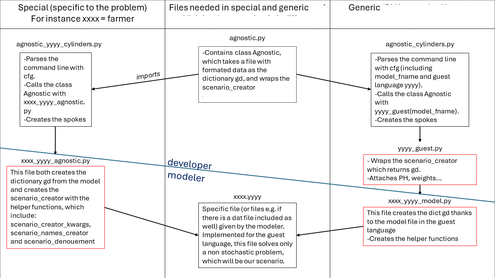

AML Agnosticism
===============

The mpi-sppy package provides callouts so that algebraic modeling languages
(AMLs) other than Pyomo can be used. A growing number of AMLs are supported
as `guest` languages (we refer to mpi-sppy as the `host`). This code is
in an alpha-release state; use with extreme caution.

From the end-user's perspective
-------------------------------

When mpi-sppy is used for a model developed in an AML for which support
has been added, the end-user runs the ``mpisppy.agnostic.agnostic_cylinders.py``
program which serves as a driver that takes command line arguments and
launches the requested cylinders.  The file
``mpisppy.agnostic.go.bash`` provides examples of a few command lines.

From the modeler's perspective
------------------------------

Assuming support has been added for the desired AML, the modeler supplies
two files:

- a model file with the model written in the guest AML (AMPL example: ``mpisppy.agnostic.examples.farmer.mod``)
- a thin model wrapper for the model file written in Python (AMPL example: ``mpisppy.agnostic.examples.farmer_ampl_model.py``). This thin python wrapper is model specific.

There can be a little confusion if there are error messages because
both files are sometimes refered to as the `model file.`

Most modelers will probably want to import the deterministic guest model into their
python wrapper for the model and the scenario_creator function in the wrapper
modifies the stochastic paramaters to have values that depend on the scenario
name argument to the scenario_creator function.

(An exception is when the guest is in Pyomo, then the wrapper
file might as well contain the model specification as well so
there typically is only one file. However, there is not particularly
good reason to use the agnostic machinery for a Pyomo model.)

From the developers perspective
-------------------------------

If support has not yet been added for an AML, it is almost easier to
add support than to write a guest interface for a particular model. To
add support for a language, you need to write a general guest
interface in Python for it (see, e.g., ampl_guest.py or
pyomo_guest.py) and you need to add/edit a few lines in
``mpisppy.agnostic.agnostic_cylinders.py`` to allow end-users to
access it.

Special Note for developers
^^^^^^^^^^^^^^^^^^^^^^^^^^^

The general-purpose guest interfaces might not be the fastest possible
for many guest languages because they don't use indexes from the
original model when updating the objective function. If this is an issue,
you might want to write a problem-specific module to replace the guest
interface and the model wrapper with a single module. For an example, see
``examples.farmer.agnostic.farmer_xxxx_agnostic``, where xxxx is replaced,
e.g., by ampl. 

Architecture
^^^^^^^^^^^^
The following picture presents the architecture of the files. 

We note "xxxx" the specific problem, for instance farmer. We note "yyyy" the guest language, for instance "ampl".
Two methods are presented. Either a method specific to the problem, or a generic method.
Regardless of the method, the file ``agnostic.py`` and ``xxxx.yyyy`` need to be used. 
``agnostic.py`` is already implemented and must not be modified as all the files presented above the line "developer".
``xxxx.yyyy`` is the model in the guest language and must be given by the modeler such as all the files under the line "modeler".

The files ``agnostic_yyyy_cylinders.py`` and ``agnostic_cylinders.py`` are equivalent.
The file ``xxxx_yyyy_agnostic.py`` for the specific case is split into ``yyyy_guest.py`` and ``xxxx_yyyy_model.py`` for the generic case.

It is worth noting that the scenario creator is defined in 3 files.
It is first defined in the file specific to the problem and the guest language ``xxxx_yyyy_model.py``. At this point it may not return a scenario.
It is then wrapped in a file only specific to the language ``yyyy_guest.py``. At chich point it returns the dictionary ``gd`` which indludes the scenario.
Finally the tree structure is attached in ``agnostic.py``.

Bundles
-------

The use of scenario bundles can dramatically improve the performance
of scenario decomposition algorithms such as PH and APH. Although mpi-sppy
has facitilites for forming bundles, the mpi-sppy
``agnostic`` package assumes that bundles will be completely handled
by the guest.  Bundles will be returned by the scenario creator function
as if they are a scenario. Although it seems sort of like a trick, it is
really the way bundles are intended to operate so we sometimes refer to 
`true` bundles, which are used in non-agnostic way as briefly
described in section :ref:`Pickled-Bundles`.

Overview of Recommended Bundle Practices
^^^^^^^^^^^^^^^^^^^^^^^^^^^^^^^^^^^^^^^^

Modify the scenario creator function so that if the scenario name
starts with the string "scen" it returns a single scenario, but if the
name starts with "bundle" it returns the full extensive formulation for
a group of scenarios (i.e. a bundle). We typically number scenarios
and the scenario or bundle number is at the end of the first
positional argument for the scenario creator function (i.e. at
the end of the scenario name).

If the name starts with bundle, the scenario creator function can call
itself with the proper list of scenario names to get the scenarios
to form the EF that will be returned. We recommend names for
bundles such as "bundle_xxx_yyy" where xxx and yyy give the
first and last scenario number in the bundle.
You could also pass in a dictionary that maps bundle numbers to lists of
scenario numbers as a keyword argument to the scenario_creator function
and then append the bundle number to "bundle" and pass it as the positional
scenario name argument to the scenario creator function.

Some notes
^^^^^^^^^^

- The helper function called ``scenario_names_creator`` needs to be co-opted
to instead create bundle names and the code in the scenario_creator function
then needs to create its own scenario names for bundles. At the time
of this writing this results in a major hack being needed in order to
get bundle information to the names creator in the Pyomo example described
below. You need to supply a function called ``bundle_hack`` in your python model file that
does whatever needs to be done to alert the names creator that there
bundles. The function takes the config object as an argument.
See ``mpisppy.agnostic.farmer4agnostic.py``
- There is a heavy bias toward uniform probabilities in the examples and in
  the mpi-sppy utilities. Scenario probabilities are attached to the scenario
  as ``_mpisppy_probability`` so if your probabilities are not uniform, you will
  need to calculate them for each bundle (your EF maker code can do that for you).  Note that even if probabilities are uniform for the scenarios, they won't
  be uniform for the bundles unless you require that the bundle size divides
  the number of scenarios.
- There is a similar bias toward two stage problems, which is
  extreme for the agnostic package. If you have a multi-stage
  problem, you can make things a lot easier for yourself if you require
  that the bundles contain all scenarios emanating from each second stage node
  (e.g., on bundle per some integer number of second stage nodes). This
  is what is done in (non-agnostic) :ref:`Pickled-Bundles`. The result of this
  is that your multi-stage problem will look like a two-stage problem to
  mpi-sppy.

Example
^^^^^^^

The example ``mpisppy.agnostic.farmer4agnostic.py`` contains example code.

.. Note::
   In order to get information from the command line about bundles into the
   ``scenario_names_creator`` the ``bundle_hack`` function is called
   called by the cylinders driver program very early. For this example,
   function sets global variables called ``bunsize`` and ``numbuns``.

The script ``mpisppy.agnostic.examples.go.bash`` runs the example (and maybe some
other examples).

Notes about Gurobipy
--------------------

The current implementation of gurobipy assumes that nonants that are in
the objective function appear direclty there (not via some other
variable constrained in some way to represent them).
